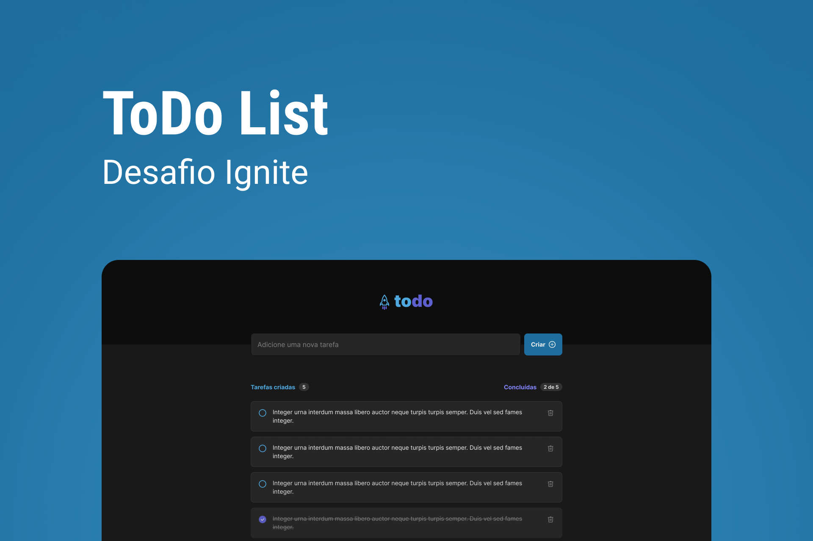

<p align="center">
    
</p>

## Sobre

O projeto **todo**, foi desenvolvido dentro da **Trilha Ignite 2022**, com o próposito de aplicar os conhecimentos adquiridos no módulo 1.
A aplicação é um todolist, que permite adicionar novas tarefas e remover tarefas concluídas.

---

## Tecnologias utilizadas

O projeto foi desenvolvido com as seguintes tecnologias:

- [ReactJS](https://pt-br.reactjs.org/)
- [Vitejs](https://vitejs.dev/)
- [Css](https://developer.mozilla.org/en-US/docs/Web/CSS)
- [Uuid](https://www.npmjs.com/package/uuid)
- [Phosphoricons](https://phosphoricons.com/)


---

## Como baixar o projeto

```bash
    # Clonar repositório
    $ git clone https://github.com/thyago608/todo

    # Entrar no diretório da aplicação
    $ cd todo

    # Baixar as depedências
    $ npm install

    # Executando a aplicação
    $ npm run dev
```

Desenvolvido por Thyago Ribeiro 👋
